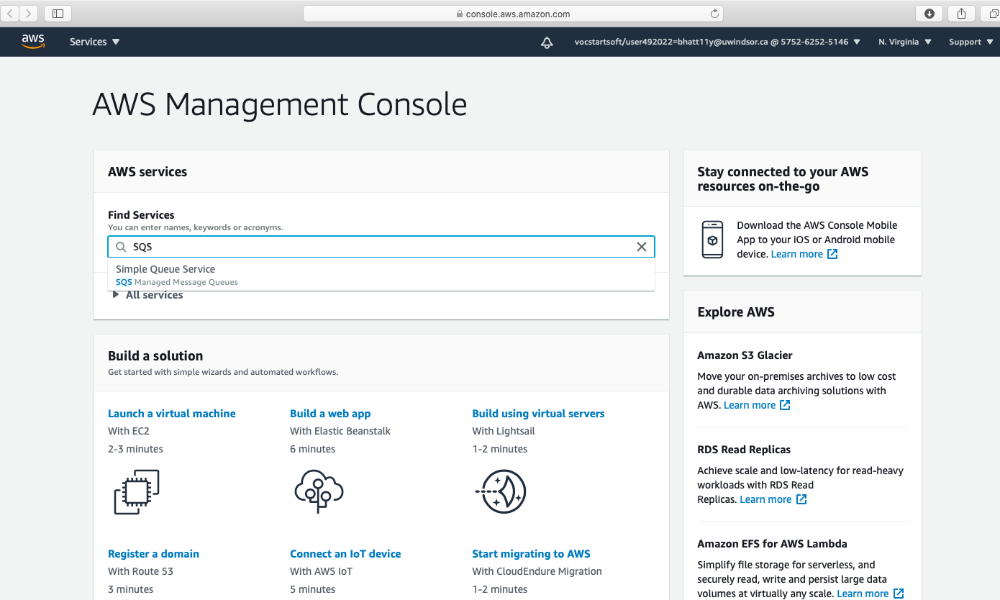
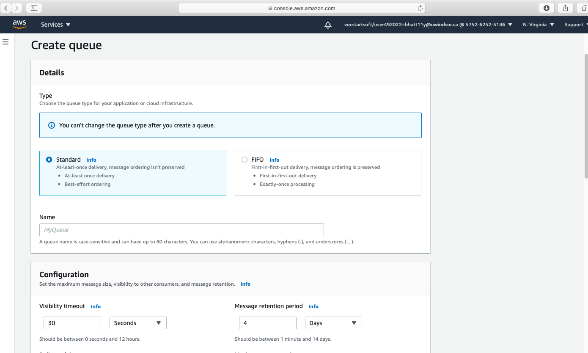
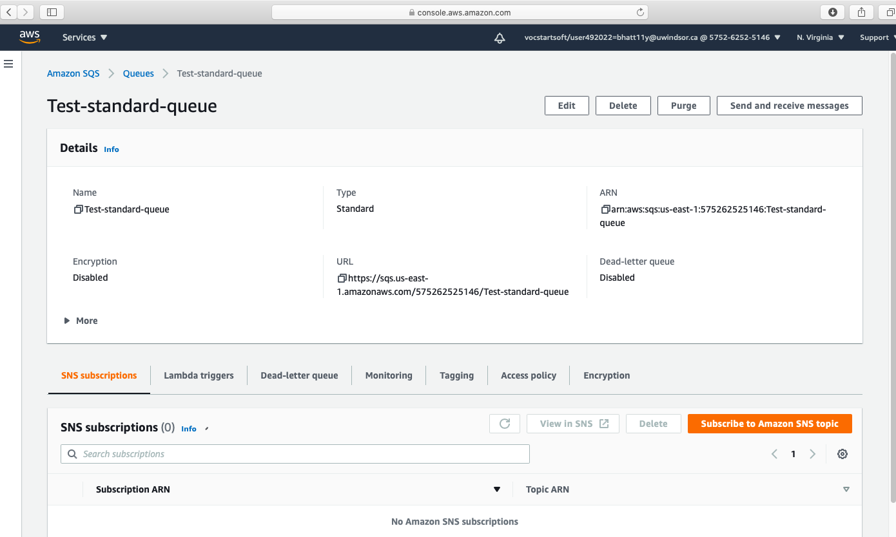
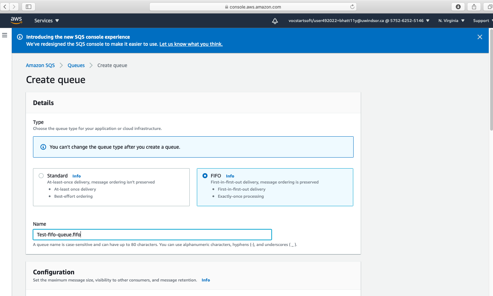

## AWS publisher/subscriber application using SpringBoot and Spring data Jpa ##
In this application, I have created publisher subscriber application using Amazon Simple Queue Service and SpringBoot app.

## Major steps ##
#### Goto AWS console ####

#### Create standard queue####
- Standard queues ensures that messages are generally delivered in the same order as they're sent.

- Once FIFO queue is created then you can get credential to access it.

#### Create FIFO queue ####
- FIFO queue FIFO (First-In-First-Out)  are designed to enhance messaging between 
applications when the order of operations and events is critical, or where duplicates can't be tolerated.

- Once FIFO queue is created then you can get credential to access it.

