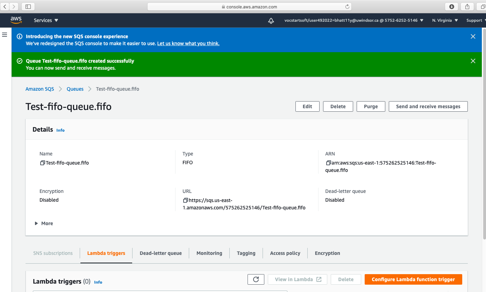

## AWS publisher/subscriber application using SpringBoot and Spring data Jpa ##
In this application, I have created publisher subscriber application using Amazon Simple Queue Service and SpringBoot app.

## Major steps ##
#### Goto AWS console ####


#### Create standard queue ####
- Standard queues ensures that messages are generally delivered in the same order as they're sent.


- Once FIFO queue is created then you can get credential to access it.


#### Create FIFO queue ####
- FIFO queue FIFO (First-In-First-Out)  are designed to enhance messaging between 
applications when the order of operations and events is critical, or where duplicates can't be tolerated.


- Once FIFO queue is created then you can get credential to access it.



## Source Code ##
1. Resource Information
```java
spring:
  datasource:
    driverClassName: com.mysql.jdbc.Driver
    url: jdbc:mysql://localhost:3306/awssqsdb
    username: root
    password: null
  jpa:
    hibernate.ddl-auto: update
    generate-ddl: true
    show-sql: true


cloud:
  aws:
    region:
      static: us-east-1
      auto: false
    credentials:
      access-key: hQJ7Xg2g28CU2X38YCo3lbpWZk4h2FgxXmalkICf
      secret-key: FwoGZXIvYXdzEB8aDG1wGJf8bZN8IDu7JCLDATxpdm/oYew9E1+hU6zDgOOwxqhuxTxVkXMHWIC89HTYAY6VZdcKxf4Hkb+Y/LYmDARe4J14jY7K1RCrKk4hmJ4AHLV6rVt2w5c7ABq4B0Ym+wKpMRrycDBWD42c5SO6P/rUgM2EkRpWmdOWoCD74iCY8346NUuhc5I+j6HrhKhq1V1+TcSYub+fsdP+G82CyHMLlTSHHQPRVLxDA7Tqw/u7Zz5MTQ5CEMGV3G5gWuxPYNfWY+WvYkWhiXIGcGTsor8b3Si2qaLvBTItJhFRYlTzT6Xh7kot/XvrlX0ftShmHvSw2XJchY5ylpQQn3WRJDSdKe7kLRWj
    end-point:
      uri:  https://sqs.us-east-1.amazonaws.com/575262525146/request.fifo  
```

2. Controller
```java
package com.raj.springapp.controller;

import java.util.List;

import org.slf4j.Logger;
import org.slf4j.LoggerFactory;
import org.springframework.beans.factory.annotation.Autowired;
import org.springframework.beans.factory.annotation.Value;
import org.springframework.cloud.aws.messaging.core.QueueMessagingTemplate;
import org.springframework.cloud.aws.messaging.listener.annotation.SqsListener;
import org.springframework.messaging.support.MessageBuilder;
import org.springframework.web.bind.annotation.GetMapping;
import org.springframework.web.bind.annotation.RequestBody;
import org.springframework.web.bind.annotation.RequestMapping;
import org.springframework.web.bind.annotation.RestController;

import com.raj.springapp.model.Student;
import com.raj.springapp.repository.StudentRepository;

@RestController
public class StudentController {

  private static final Logger LOG = LoggerFactory.getLogger(StudentController.class);

  @Autowired StudentRepository studentRepository;

  @Autowired private QueueMessagingTemplate queueMessagingTemplate;

  @Value("${cloud.aws.end-point.uri}")
  private String awsSQSStandardQueue;

  @RequestMapping("/sendMessageToSQS")
  public void sendMessage() {
    queueMessagingTemplate.send(
        awsSQSStandardQueue,
        MessageBuilder.withPayload("Hi I'm excited to send message to AWS SQS").build());
  }

  @SqsListener("request.fifo")
  public void getMessage(String message) {
    studentRepository.save(new Student(message));
  }

  @RequestMapping(value = "/all")
  public List<Student> getAll() {
    return studentRepository.findAll();
  }
}

```

3. Jpa repository
```java
package com.raj.springapp.repository;

import org.springframework.data.jpa.repository.JpaRepository;

import com.raj.springapp.model.Student;

public interface StudentRepository extends JpaRepository<Student, Integer> {}

```

4. POJO
```java
package com.raj.springapp.model;

import javax.persistence.Column;
import javax.persistence.Entity;
import javax.persistence.GeneratedValue;
import javax.persistence.Id;

@Entity
public class Student {

  @Id
  @GeneratedValue
  @Column(name = "id")
  private Integer id;

  @Column(name = "message")
  private String message;

  public Student(String message) {
    super();
    this.message = message;
  }

  public Integer getId() {
    return id;
  }

  public void setId(Integer id) {
    this.id = id;
  }

  public String getMessage() {
    return message;
  }

  public void setMessage(String message) {
    this.message = message;
  }
}

```

5. SpringBoot app launcher
```java
package com.raj.springapp;

import org.springframework.boot.SpringApplication;
import org.springframework.boot.autoconfigure.SpringBootApplication;

@SpringBootApplication
public class AwsSqsConsumerSprintBootJpaApplication {

  public static void main(String[] args) {
    SpringApplication.run(AwsSqsConsumerSprintBootJpaApplication.class, args);
  }
}

```